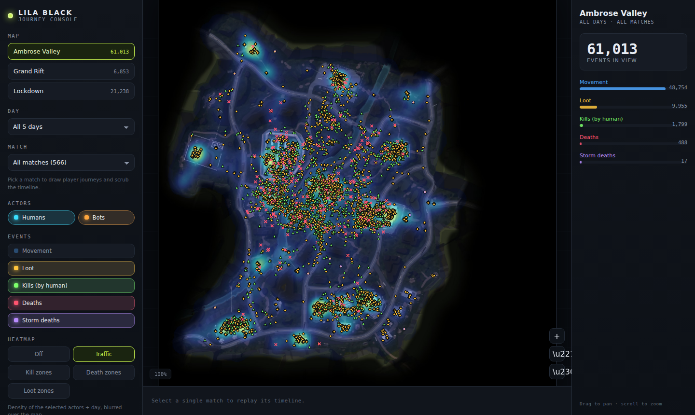

# LILA BLACK — Player Journey Console

A web tool that turns raw LILA BLACK telemetry into something a **Level Designer** can open in a browser and actually use: player journeys drawn on the real minimaps, humans vs bots, combat / loot / storm events, filtering by map · day · match, a per-match playback timeline, and kill / death / loot / traffic heatmaps.

**Live demo:** `<add your Vercel/Netlify URL here after deploy>`



---

## What it does

| Capability | Where |
|---|---|
| Player journeys on the correct minimap, world coords mapped to pixels | center canvas (select a match) |
| Humans (cyan) vs bots (amber), toggleable | left rail → Actors |
| Kills, deaths, loot, storm as distinct markers | left rail → Events |
| Filter by map / day / match | left rail |
| Timeline playback of a single match | bottom scrubber |
| Heatmaps: traffic, kill zones, death zones, loot zones | left rail → Heatmap |
| Pan + zoom (1×–8×) | scroll / drag, zoom tools bottom-right |
| Live event breakdown for the current selection | right inspector |

---

## Tech stack

- **Pipeline:** Python 3 + `pyarrow` / `pandas` / `Pillow`. Reads parquet, decodes the byte-encoded `event` column, maps world `(x, z)` → normalized minimap UV, downscales the (very large) minimaps, and emits compact JSON.
- **Frontend:** React 18 + Vite. Rendering is hand-rolled HTML `<canvas>` (no chart library) for the marker scatter, journey polylines, playback, and a custom Gaussian-splat heatmap. Plain CSS for the UI.
- **Hosting:** any static host (Vercel / Netlify / GitHub Pages). The build is fully static — data and images are served as plain assets.

Why this split: the parquet quirks (byte decoding, bot detection, coordinate transform) are cheapest to solve once in Python; the browser then loads small pre-baked JSON and stays fast and interactive for a non-technical user. See [ARCHITECTURE.md](./ARCHITECTURE.md).

---

## Repository layout

```
lila-player-journey/
├── pipeline/
│   ├── process.py            # parquet -> web/public/{data,minimaps}
│   └── requirements.txt
├── web/
│   ├── public/
│   │   ├── data/             # generated JSON (committed so deploy works out of the box)
│   │   └── minimaps/         # downscaled minimaps (generated)
│   ├── src/                  # React app
│   ├── index.html
│   └── package.json
├── vercel.json               # deploy config (Vercel)
├── netlify.toml              # deploy config (Netlify)
├── ARCHITECTURE.md           # design + coordinate-mapping walkthrough + tradeoffs
└── INSIGHTS.md               # three things the tool revealed about the game
```

---

## Setup

### Prerequisites
- Node.js 18+
- Python 3.10+ (only needed if you want to regenerate data)

### 1. (Optional) Regenerate data from the raw parquet

The generated `web/public/data/` and `web/public/minimaps/` are committed, so you can skip this and go straight to step 2. To rebuild from the original `player_data/`:

```bash
cd pipeline
pip install -r requirements.txt
python process.py --src /path/to/player_data --out ../web/public
```

`--src` must point at the folder that contains the `February_*` day folders and a `minimaps/` folder.

### 2. Run the frontend

```bash
cd web
npm install
npm run dev        # http://localhost:5173
```

### 3. Production build

```bash
cd web
npm run build      # outputs web/dist
npm run preview    # serve the build locally
```

---

## Deploy

No environment variables are required.

**Vercel** — import the repo; `vercel.json` already sets:
```
build: cd web && npm install && npm run build   |   output: web/dist
```

**Netlify** — import the repo; `netlify.toml` sets base `web`, publish `dist`.

**GitHub Pages / any static host** — upload the contents of `web/dist`. Vite is configured with `base: './'` so it works from any sub-path.

After deploying, paste the URL into the **Live demo** line above.

---

## Notes / assumptions

The data has a few quirks that shaped the build; the full list with how each was handled is in [ARCHITECTURE.md](./ARCHITECTURE.md#assumptions). The headline ones:

- Minimaps are **not** 1024×1024 as the README states — they're 2160²–9000². Coordinates are stored normalized (0–1) so rendering is resolution-independent.
- `ts` spans **under a second per match**, so it is used for event **ordering**, not as real elapsed seconds. Playback is sequence-normalized and labelled as such in the UI.
- Bots vs humans are detected from the `user_id` shape (UUID = human, short numeric = bot), per the dataset README.
